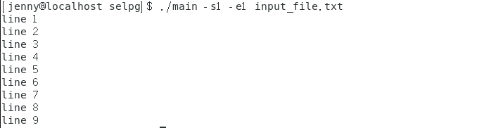
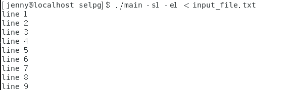
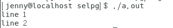
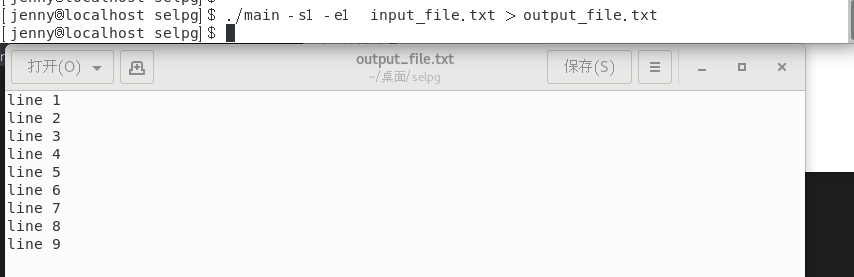
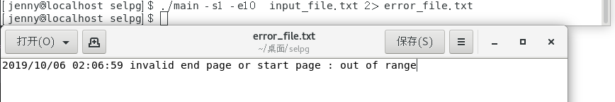
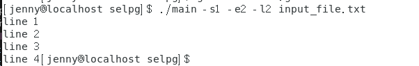
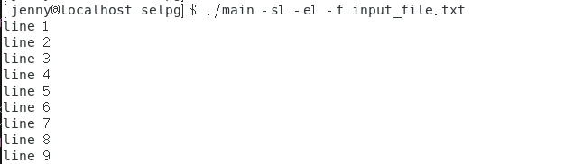

## 简单的CLI程序——selpg

### selpg 程序逻辑

selpg 是从文本输入选择页范围的实用程序。该输入可以来自作为最后一个命令行参数指定的文件，在没有给出文件名参数时也可以来自标准输入。

selpg 首先处理所有的命令行参数。在扫描了所有的选项参数（也就是那些以连字符为前缀的参数）后，如果 selpg 发现还有一个参数，则它会接受该参数为输入文件的名称并尝试打开它以进行读取。如果没有其它参数，则 selpg 假定输入来自标准输入。

### pflag包依赖

首先需要安装包依赖，使用`go get github.com/spf13/pflag`命令。


在使用pflag包时，需要在import中包含该包。

```go
import(
	...
    "github.com/spf13/pflag"
)
```

### 命令行参数读取

`pflag`是`go`语言中一种解析命令行参数的包，该包的使用方法跟`flag`近似，但功能更为强大。定义`pflag`的方法跟`flag`类似。在`selpg`这个应用中，一共有5个参数(opts)：2个必须出现的参数(mandatory_opts)和3个可选参数(optional_opts)；1个命令要处理的其他参数(other_args)，即输入文件名。

```shell
`$ command mandatory_opts [ optional_opts ] [ other_args ]`
```

- `command` 是命令本身的名称。
- `mandatory_opts` 是为使命令正常工作必须出现的选项列表，在本例中为`-s`和`-e`。
- `optional_opts` 是可指定也可不指定的选项列表，这由用户来选择，在本例中为`-l -f -d`，为；但是，其中一些参数可能是互斥的，如同 selpg 的“-f”和“-l”选项的情况（详情见下文）。
- `other_args` 是命令要处理的其它参数的列表；这可以是任何东西，而不仅仅是文件名。在本例中，为输入文件的文件名。

在`init`中定义`pflag`

```go
var start_page *int
var end_page *int
var page_len *int
var page_type *bool
var print_dest *string

func init() {
	start_page = pflag.IntP("start_page", "s", -1, "The start page.")
	end_page   = pflag.IntP("end_page", "e", -1, "The end page.")
	page_len   = pflag.IntP("page_len", "l", 72, "Default value, can be overriden by \"-l number\" on command line ")
	page_type  = pflag.BoolP("page_type", "f", false, "\'l\' for lines-delimited, \'f\' for form-feed-delimited.")
	print_dest = pflag.StringP("print_dest", "d", "", "The destination of the printer.")
}

```

### 命令行参数检查

仿照源程序中的`process_args()`函数，完成go语言版本的命令行参数检查函数。

```go
/*================================= process_args() ================*/
func process_args() error {
	// check mandatory opts
	if *start_page == -1 || *end_page == -1 {
		return errors.New("not enough arguments")
	}
	// validity check of start page and end page
	if *start_page < 1 || *start_page > INT_MAX-1 {
		return errors.New("invalid start page")
	}
	if *end_page < 1 || *end_page > INT_MAX-1 || *end_page < *start_page {
		return errors.New("invalid end page")
	}
	// check mutually exclusive options
	if *page_type == true && *page_len != 72 {
		return errors.New("-l and -f are mutually exclusive options")
	}
	// validity check of page length
	if *page_len < 1 || *page_len > INT_MAX-1 {
		return errors.New("invalid page length")
	}
	// check other args
	if pflag.NArg() > 1 {
		return errors.New("invalid infilename")
	}
	return nil;
}
```


### 输入流处理

如果有其他参数（即输入文件名），那么需要从文件中读取数据，否则默认从标准输入流中读取数据。

```go
	var line string
	line_cnt := 0
	// io process
	if pflag.NArg() == 0{
		// from stdin
		input := bufio.NewScanner(os.Stdin)
		for input.Scan() {
			if line_cnt > 0 {
				line += "\n"
			}
			line += input.Text()
			line_cnt++
		}
	} else {
		// from file
		infilename,err := os.Open(pflag.Arg(0))
		if(err != nil) {
			return err
		}
		input := bufio.NewScanner(infilename)
		for input.Scan() {
			if line_cnt > 0 {
				line += "\n"
			}
			line += input.Text()
			line_cnt++
		}
	}
```

根据`page_type`确定分页符，进行分页。

```go
	page_ctr := "\n"
	if(*page_type == true) {
		page_ctr = "\f"
	} 

	arr := strings.Split(line,page_ctr);
```

此时需要对`start_page`和`end_page`再次进行有效性检查，查看是否超出了页面范围，如果没超出范围就把需要打印的数据单独保存起来。

```go
	pages := math.Ceil(float64(len(arr))/float64(*page_len))
	if *end_page >int(pages) || *start_page > int(pages) {
		return errors.New("invalid end page or start page : out of range")
	}
	var sub string;
	for i:= (*page_len) *(*start_page-1); i < (*page_len) *(*end_page)  && i < len(arr); i++ {
		if i!= (*page_len) *(*start_page-1){
			sub += page_ctr;
		}
		sub += arr[i];
	}
```

最后判断是否设置了打印机，如果没设置则显示到标准输出流上。

```go
	if *print_dest =="" {
		fmt.Printf(sub)
	}  else {
		cmd := exec.Command("lp", "-d"+*print_dest)
		cmd.Stdin = strings.NewReader(sub);
		err := cmd.Run()
		if err != nil {
			return err
		}
	}

```


### 测试

测试文件`input_file.txt`内容如下：

```
line 1
line 2
line 3
line 4
line 5
line 6
line 7
line 8
line 9
```


1. `./main -s1 -e1 input_file.txt`




2. `./main -s1 -e1 < input_file.txt`




3. `./a.out | ./main -s1 -e1 `

`./a.out`输出为




4. ` ./main -s1 -e1  input_file.txt > output_file.txt`




5. `./main -s1 -e10  input_file.txt 2> error_file.txt`




6. `./main -s1 -e2 -l2 input_file.txt`




7. `./main -s1 -e1 -f input_file.txt`




8. `./main -s1 -e1 -dlp1 input_file.txt`

因为没有连接打印机所以会直接报错

# CLI-selpg
